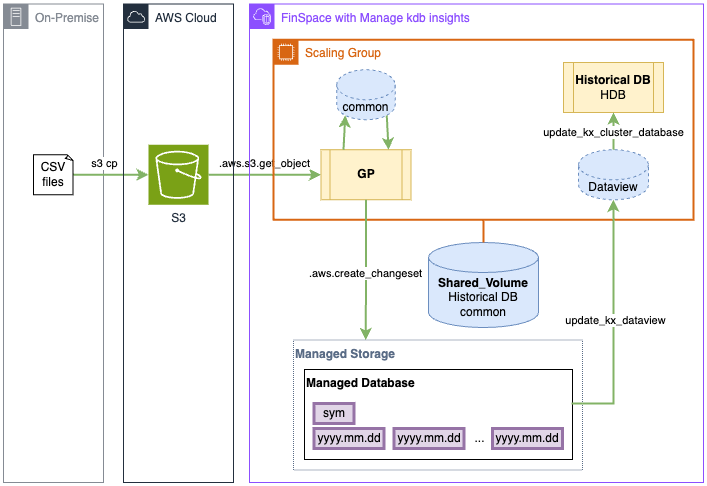

# Procesing External CSV Files into a Managed kdb Database
This example shows how one can lever a Managed kdb Insights cluster to process externally sourced data files (in csv.gz format) into a Managed kdb Insights database in FinSpace.

Please see the below notebooks for details on how this is accomplished.

### Algoseek LLC Data
Trade and Quote data has been provided by [AlgoSeek LLC](https://www.algoseek.com/), you can learn more about their data offerings from their home page.

## Solution Architecture

- S3: csv.gz files are made available in a customer's S3 bucket that their FinSpace environment can access   
- Scaling Group: contains two clusters   
  - General Purpose (GP) cluster that will process the csv.gz files   
  - Historical Database (HDB) cluster that will service queries for the processed data   
- Shared Volume: caches the historical database and is working disk for file processing   
- A Managed database contains the kdb database   
- Database is made available to the HDB on a Shared Volume as a Dataview
  - Dataview also represents a version of the managed database
  - Changesets enable versioning of the managed database   

### Processing
- Files are copied onto the shared volume's common directory   
  - q function used by GP cluster: .aws.s3.get_object   
- Processed files are added to the managed database with the .aws.create_changeset function   
- The managed database is cached on the shared volume   
- The database on the shared volume is updated to a later (current/updated) using the update_kx_view function   
- The HDB cluster is update to use the latest (current/updated) dataview using the update_kx_cluster_database function   

## References
[FinSpace Managed kdb Insights](https://docs.aws.amazon.com/finspace/latest/userguide/finspace-managed-kdb.html): AWS Finspace Documentation   
[FinSpace q API](https://docs.aws.amazon.com/finspace/latest/userguide/interacting-with-kdb-q-apis.html): AWS q API in FinSpace   
[kdb q](https://code.kx.com/q/ref/): KX q/kdb documentation  
[kdb PyKX](https://code.kx.com/pykx/2.4/): KX PyKX documentation     

## Notebooks
[create_all](create_all.ipynb): creates all infra components of the example and populates the managed database with an initially empty table   
[process_algoseek](process_algoseek.ipynb): Process the TAQ data (as supplied by [AlgoSeek](https://www.algoseek.com/)) into the Managed Database   
[delete_all](delete_all.ipynb): Deletes all created resources from create_all   

### Other Files
[algoseek-marketdata.tar.gz](algoseek-marketdata.tar.gz): Tarball of two days (2021-01-04, 2021-04-05) of TAQ data for tickers FB, AMZN, NFLX, GOOG    
[requirements.txt](requirements.txt): Required Python libraries   

