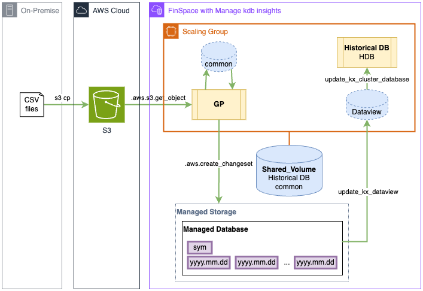

# Procesing External CSV Files into a Managed kdb Database
This example shows how one can lever a Managed kdb Insights cluster to process externally sourced data files (in csv.gz format) into a Managed kdb Insights database in FinSpace.

Please see the below notebooks for details on how this is accomplished.

## Solution Architecture

## References
[FinSpace Managed kdb Insights](https://docs.aws.amazon.com/finspace/latest/userguide/finspace-managed-kdb.html): Service Documentation   
[FinSpace q API](https://docs.aws.amazon.com/finspace/latest/userguide/interacting-with-kdb-q-apis.html): q API of Service   
[kdb q](https://code.kx.com/q/ref/): KX q/kdb documentation  
[kdb PyKX](https://code.kx.com/pykx/2.4/): K PyKX documentation     

## Notebooks
[create_all](create_all.ipynb): creates all infra components of the example and populates the managed database with an initially empty table   
[process_algoseek](process_algoseek.ipynb): Process the TAQ data (as supplied by [AlgoSeek](https://www.algoseek.com/)) into the Managed Database   
[delete_all](delete_all.ipynb): Deletes all created resources from create_all   

### Other Files
[algoseek-marketdata.tar.gz](algoseek-marketdata.tar.gz): Tarball of two days of TAQ data for FAANG tickers    
[AMZN-100.csv.gz](AMZN-100.csv.gz): 100 TAQ records in csv.gz format for AMZN ticker    
[requirements.txt](requirements.txt): Required Python libraries   

