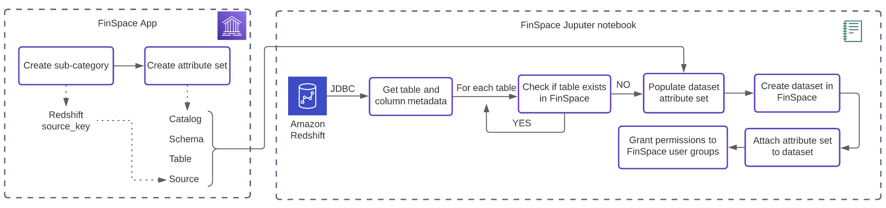
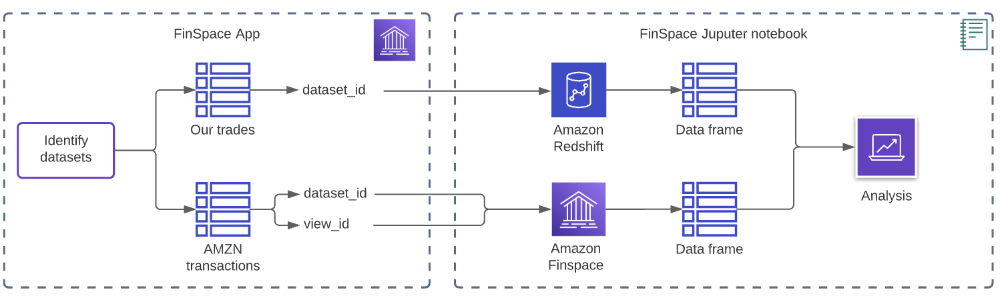

# Amazon FinSpace Examples

## Connecting to Amazon Redshift from FinSpace

This repository contains example notebooks that show how to connect to an Amazon Redhsift cluster from Amazon FinSpace using JDBC driver.

### Import tables and metadata

The [Import notebook](redshift_in_finspace_import.ipynb) shows how to create datasets in FinSpace based on table metadata in Amazon Redshift. 
It covers the following steps:  
1. Create a category and an attribute set in FinSpace.
2. Connect to Amazon Redshift from FinSpace Jupyter notebook using JDBC.
3. Create dataset in Amazon FinSpace for each table in Amazon Redshift. Add description, owner, and attributes to each dataset to help with data discovery and access control.

### Analyze data

Once you created datasets in FinSpace, you can use the attached attribute set to connect to the Amazon Redshift cluster directly from FinSpace without specifying database, schema, or table name. 
The [analysis notebook](redshift_in_finspace_analysis.ipynb), shows how to:  
1. Connect to Amazon Redshift using the attribute set from FinSpace
2. Use data from both Amazon FinSpace and Amazon Redshift to evaluate trade performance based on daily price for AMZN stock.

## FAQ

**What do I need in order to get started?**  
- Setup FinSpace environment by following the [“Create an Amazon FinSpace Environment”](https://docs.aws.amazon.com/finspace/latest/userguide/create-an-amazon-finspace-environment.html) guide
- Install Capital Markets sample data bundle, as explained in the [“Sample Data Bundle”](https://docs.aws.amazon.com/finspace/latest/userguide/sample-data-bundle.html) guide
- Ensure you have permissions to ‘Manage Categories and Controlled Vocabularies’ and ‘Manage Attribute Sets’ in FinSpace
- Create an Amazon Redshift cluster in the same AWS account as the FinSpace environment
  - Follow the [“Create Cluster Guide”](https://docs.aws.amazon.com/redshift/latest/dg/tutorial-loading-data-launch-cluster.html) guide to get started
  - Create a superuser and ensure the cluster is publicly accessible by following [this guide](https://aws.amazon.com/premiumsupport/knowledge-center/redshift-cluster-private-public/)
  - Create a table in Amazon Redshift and insert trading transaction data using [these SQL queries](finspace_redshift.sql)
