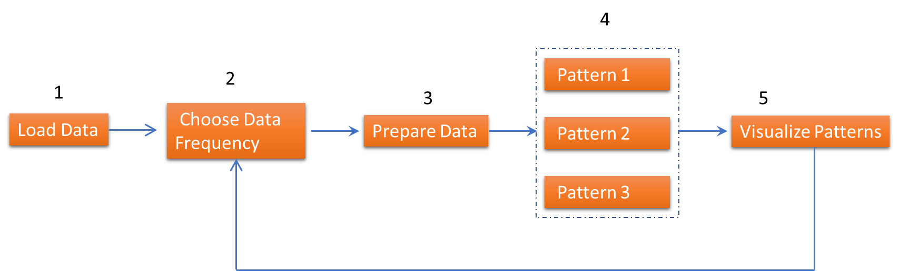
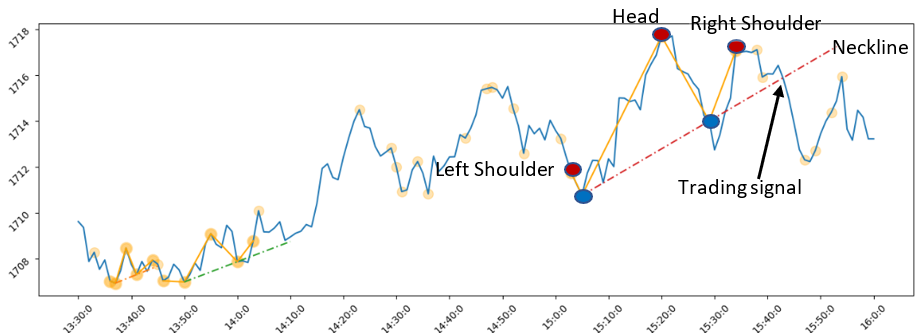

## Performing price action analysis with FinSpace

This repository contains a sample notebook that uses FinSpace to backtest price action trading pattern "[Head and Shoulders](https://www.investopedia.com/terms/h/head-shoulders.asp)", referred to as HS.

### Price action workflow

The [price action notebook](price-action.ipynb) shows the workflow of loading trade and quote data and identifying price action patterns. It covers the following steps:
Load raw security price data into FinSpace for further processing and analysis.
Select the desired trading frequency
Prepare data for the pattern identification algorithm/model
Run the algorithm/model to identify the price action patterns
Plot the pattern on the price chart for verification

### FinSpace workflow

The steps below show how to run the Jupyter notebook in managed Amazon FinSpace Spark cluster to perform price action analysis on the HS pattern:

1.	Load “US Equity TAQ - AMZN 6 Months” data provided as part of the Capital Markets Sample Data Bundle installed in the Amazon FinSpace environment by default. 
2.	Aggregate the price data at various lower frequencies and identify the ones for which the price action patterns are pronounced and tradable.  
3.	Further aggregate the data to the desired frequency by calling [FinSpace functions](https://docs.aws.amazon.com/finspace/latest/userguide/finspace-time-series-library.html) such as time bar collection, summarization, filling, and filtering.
4.  Smooth the resultant price series using functions provided in [FinSpace analytical library](https://docs.aws.amazon.com/finspace/latest/userguide/time-series-analyze.title.html) (e.g., Exponential Moving Average)  
4.	Find all the local minima and maxima of the smoothed price series, then identify both HS and Inverse HS (IHS) patterns. 
5.	Plot all the identified HS and IHS patterns in the price series chart.

.

## Conclusion

This notebook demonstrates how to perform Price Action Analysis using [FinSpace](https://aws.amazon.com/finspace) and PySpark. You can use it as a foundation to backtest price action trading patterns of your interest.
